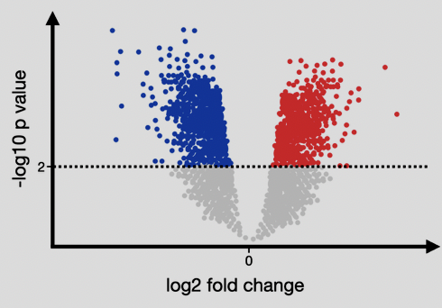

# Visualizing Differential Gene Expression with Volcano Plots
By Ishvari Desai, Emily Wei, Soyeon Lee(Amy)

## Introduction

Gene expression studies often result in large datasets that contain detailed measurements of RNA or protein levels across various experimental conditions. To derive meaningful insights from these datasets, effective visualization methods are crucial. These visualizations provide a clear picture of how genes are expressed differently under specific conditions.

Visualizing gene expression allows researchers to understand and interpret differences in gene activity between various biological conditions. For example, visualizations enable researchers to pinpoint specific genes of interest, interpret complex datasets, and present results in an intuitive and comprehensible format. They play a critical role in hypothesis generation, pathway analysis, and identifying candidate biomarkers or therapeutic targets.

### Differential Gene Expression
Differential gene expression (DGE) refers to the process of identifying genes whose expression levels vary significantly between two or more experimental conditions. These changes may indicate biological responses to treatments, diseases, or environmental factors.

### Key Tools for DGE Analysis
Commonly used tools for DGE include:

* DESeq2: R package for robust statistical testing of differential expression.

* edgeR: Another R package widely used for count-based expression data.

These tools typically output statistical metrics like fold change and adjusted p-values, which are essential for volcano plot visualization.


## Volcano Plot
A volcano plot is a scatter plot designed to visualize gene expression changes between conditions. It combines the magnitude of expression changes (fold change) with their statistical significance (p-value) to highlight the most impactful genes.



Up-regulated Genes:

* Found on the right side of the plot.
* Represent genes with significantly increased expression in the condition of interest.
* Highlighted in red.

Down-regulated Genes:
* Found on the left side of the plot.
* Represent genes with significantly decreased expression.
* Highlighted in blue.

Non-significant Genes:
* Represent genes with no statistically significant expression changes.
* Highlighted in grey

Significance Threshold: A horizontal line at p = 0.05 indicates the statistical significance cutoff.

Fold Change Threshold: Genes are further classified based on their biological significance using fold change thresholds.

X-Axis (Log2 Fold Change): The x-axis shows the log2 fold change in gene expression, representing the magnitude of change between two conditions. Values farther from zero indicate a greater change.

Y-Axis (-log10 P-Value): The y-axis displays the -log10 p-value, representing the statistical significance of the changes. Larger values indicate higher statistical confidence.


## Generating Volcano Plots

Volcano plots can be generated using tools like R and Python.

R: Libraries such as ggplot2 and EnhancedVolcano are widely used.
Python: Libraries like Matplotlib and Seaborn offer similar functionality

Using the ggplot2 library, we map gene expression changes and highlight regions of significance.

**Code Example in R:**
```
library(ggplot2)

ggplot(data, aes(x=log2FoldChange, y=-log10(pvalue))) +
  geom_point(aes(color=significance)) +
  geom_hline(yintercept=-log10(0.05), linetype="dashed") +
  geom_vline(xintercept=c(-1, 1), linetype="dashed") +
  theme_minimal()

```
*Key Features:*
geom_point: Plots each gene as a point.
Color Coding: Points are colored based on significance.
Dashed Lines: Represent p-value and fold-change thresholds.

*Output:*
A clear volcano plot highlighting up-regulated and down-regulated genes.

**Code Example in Python:**
```
import matplotlib.pyplot as plt
import numpy as np

# Example data
data = {'log2FoldChange': np.random.normal(size=1000), 
        'pvalue': np.random.uniform(0.001, 0.1, size=1000)}

# Add significance column
data['significance'] = ['Significant' if abs(x) > 1 and y < 0.05 else 'Not Significant' 
                        for x, y in zip(data['log2FoldChange'], data['pvalue'])]

# Extract values
x = data['log2FoldChange']
y = -np.log10(data['pvalue'])
colors = ['red' if sig == 'Significant' else 'gray' for sig in data['significance']]

# Plot
plt.figure(figsize=(8, 6))
plt.scatter(x, y, c=colors, alpha=0.7)
plt.axhline(-np.log10(0.05), color='blue', linestyle='dashed', linewidth=1)
plt.axvline(-1, color='green', linestyle='dashed', linewidth=1)
plt.axvline(1, color='green', linestyle='dashed', linewidth=1)
plt.title('Volcano Plot')
plt.xlabel('log2 Fold Change')
plt.ylabel('-log10(P-value)')
plt.show()
```
*Key Features:*
plt.scatter: Plots genes as points, colored based on significance.
Dashed Lines: Highlight thresholds for significance and fold-change.
Customization: Matplotlib allows extensive styling and customization.

*Output:*
A volcano plot similar to R’s visualization, emphasizing significant gene expression changes.

Both R and Python excel at generating volcano plots. The choice of tool depends on the user’s familiarity and the specific requirements of the analysis.
